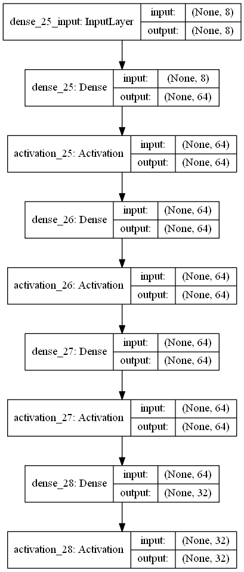
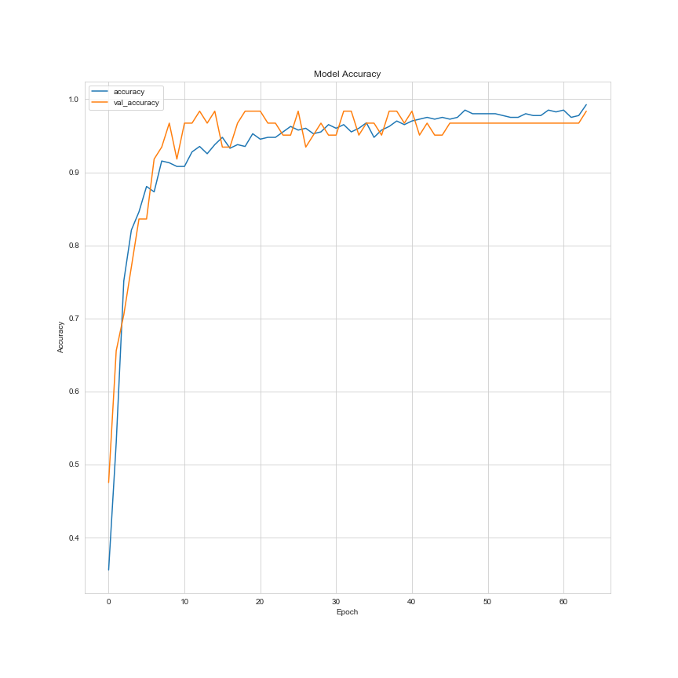

# Predicting Breast Cancer Class (Benign or Malignant) with Using XGBoost and Artificial Neural Networks 

## Problem Statement

The purpose of this study is based on the available data, it was estimated whether breast cancer is benign or malignant. 

This breast cancer databases was obtained from the **University of Wisconsin
   Hospitals**, Madison from **Dr. William H. Wolberg**.  If you publish results
   when using this database, then please include ***breast-cancer-wisconsin.names*** in your
   acknowledgements.

## Dataset

Dataset is downloaded from [archive.ics.uci.edu](https://archive.ics.uci.edu/ml/datasets/breast+cancer+wisconsin+(diagnostic)) website. You can find the details of the dataset in that website and also in the ***breast-cancer-wisconsin.names*** named file. Dataset has **10 columns** and **699 rows without the header**.

Attribute Information:

 1. ID number

 2. Diagnosis (M = malignant, B = benign)

 3. 3-32 

Ten real-valued features are computed for each cell nucleus:

 - radius (mean of distances from center to points on the perimeter)
 - texture (standard deviation of gray-scale values)
 - perimeter
 - area
 - smoothness (local variation in radius lengths)
 - compactness (perimeter^2 / area - 1.0)
 - concavity (severity of concave portions of the contour)
 - concave points (number of concave portions of the contour)
 - symmetry
 - fractal dimension ("coastline approximation" - 1)

## Methodology

In this project, as stated in the title, results were obtained through **XGBoost** and **artificial neural networks** methods. 

## Analysis

You can find plot of **accuracy** and **val_accuracy** in ***Plot*** file. Accuracy values and also plot can change a bit after you run the algorithm.

There were **16 missing features** that were replaced by the mean value of the column.

---

**Model of ANN**

     

**ANN Accuracy and Validation Accuracy Plot**

**ANN Prediction**

> Model predicted as maligant. 
> Model predicted class as [4].

---

**XGBoost Prediction**

***Confusion Matrix(XGBoost):***
| 72 | 3 |
|--|--|
| **5** | **73** |

**Accuracy score(XGBoost): 0.9477124183006536**

> Model predicted as maligant. 
> Model predicted class as [4.].

Process took 3.6448304653167725 seconds.

## How to Run Code

Before running the code make sure that you have these libraries:

 - pandas 
 - time
 - sklearn
 - seaborn
 - numpy
 - warnings
 - xgboost
 - matplotlib
 - keras
    
## Contact Me

If you have something to say to me please contact me: 

 - Twitter: [Doguilmak](https://twitter.com/Doguilmak)
 - Mail address: doguilmak@gmail.com
 
